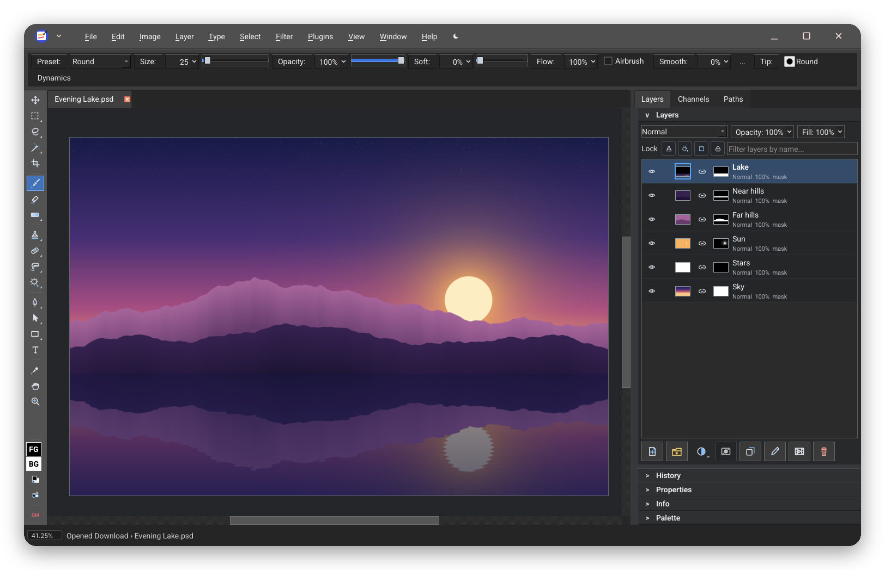
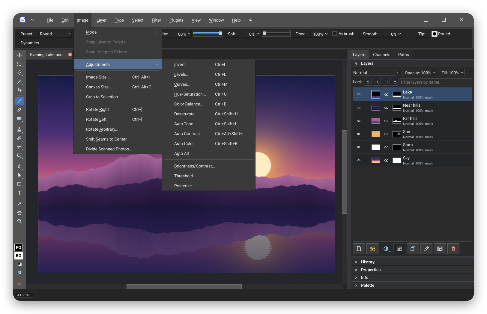
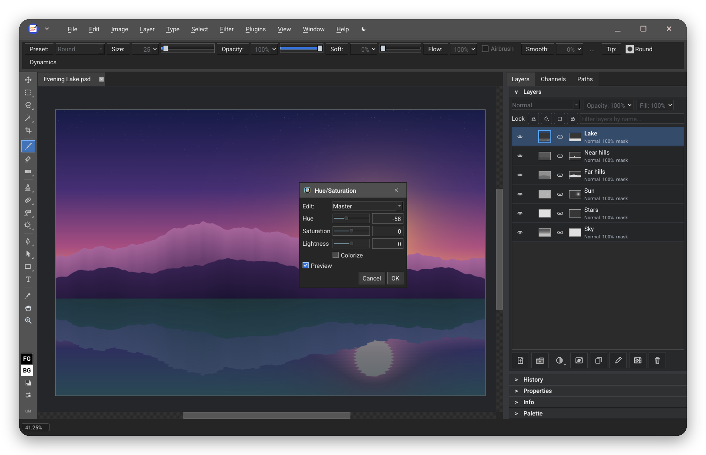
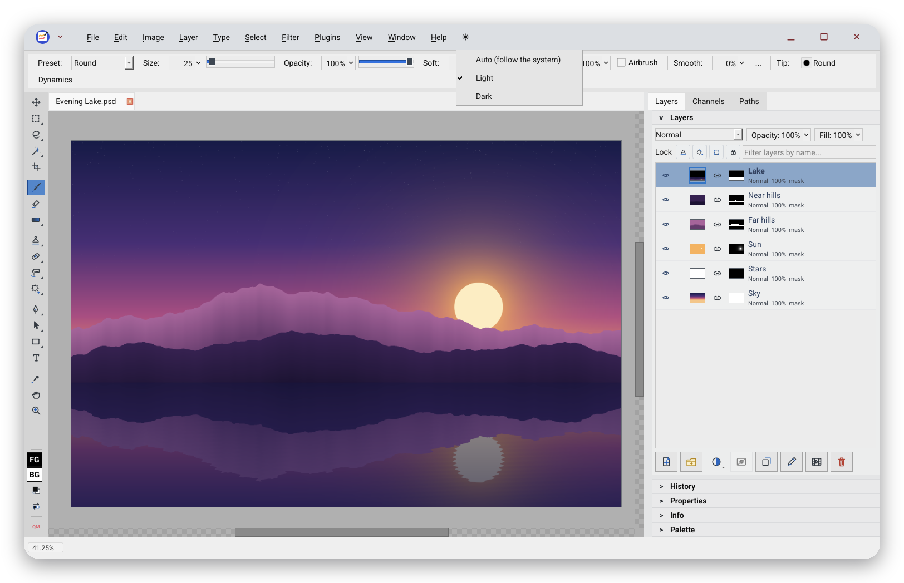
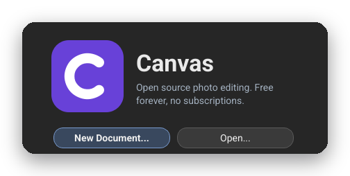

<p align="center">
  
</p>

<h1 align="center">Canvas</h1>

<p align="center">
  <b>A full-featured, Photoshop-style image editor for Googlebooks.</b><br>
  <a href="https://github.com/SethRobinson/Patchy">Patchy</a>, the open-source editor for PSD files, layers and masks, made into a
  Googlebook app: one download for every Googlebook, Intel and Snapdragon.
</p>

<p align="center">
  <a href="../../releases/latest/download/Canvas.apk"><b>⬇ Download Canvas.apk</b></a>
  &nbsp;·&nbsp; <a href="#install">Install</a>
  &nbsp;·&nbsp; <a href="#privacy">Privacy</a>
  &nbsp;·&nbsp; <a href="CHANGELOG.md">What's new</a>
  &nbsp;·&nbsp; <a href="#licenses">Licenses</a>
</p>

<p align="center">
  
  
  
  
  
</p>

<p align="center"><sub>A personal passion project by <a href="https://github.com/kuscher">Alexander Kuscher</a>, proudly developed entirely on a Googlebook.
Not affiliated with or endorsed by any employer, or by Patchy's author (<a href="#about-this-project">more</a>).</sub></p>

<p align="center">
  
</p>

## What it is

Canvas is **Patchy**, Seth A. Robinson's free, open-source image editor, built as an app for
Googlebooks. Patchy is made for accurate PSD and PSB editing and round trips with Photoshop, and
Canvas brings all of it to the Googlebook, working offline:

- **Layers** with masks, blend modes, groups, **adjustment layers** and **layer styles**
- **Smart Objects**, editable **text** and **vector shapes**
- **Brushes** with pressure dynamics, selections, filters, gradients and patterns
- **PSD and PSB** in and out with their layers; PNG, JPEG, WebP, TIFF, GIF, SVG, RAW photos and more
- **JavaScript scripting**, palettes, seamless tiling and much more from Patchy

<p align="center">
  
  <br><sub>Menus live in the window's title bar and open as you move along it, like on any desktop.</sub>
</p>

## Made for the Googlebook

Patchy runs on Windows, macOS, Linux and in the browser. Canvas adds what it takes to feel at
home on a Googlebook:

- **A real desktop window.** The menu bar sits in the title bar next to the window buttons; menus
  follow the pointer; dialogs have proper frames; everything stays sharp at the Googlebook's
  display scaling, maximized, restored or resized.
- **Your files, the Android way.** Open and Save use the system file picker, so Downloads, Google
  Drive, USB drives and other apps' storage all work. **Open with** and **Share** from Files,
  Photos or Chrome open images straight in Canvas. Recent files and the status bar name documents
  by where they live ("Download › photo.psd").
- **Trackpad and touchscreen gestures:** pinch to zoom and two-finger pan; a single finger still
  paints.
- **Dark by default,** with Auto (follow the system) and Light one click away in the menu bar.
- **Print** through Android's print dialog, including Save as PDF.
- **Nothing gets lost:** if Android closes Canvas in the background, unsaved documents come back
  the next time you open it.

<p align="center">
  
  <br><sub>Adjustments preview live on the canvas.</sub>
</p>

<p align="center">
  
  <br><sub>The Appearance menu at the end of the menu bar: Auto, Light or Dark.</sub>
</p>

## Install

Canvas isn't in a store; you install the APK from this page. It takes a minute:

1. On your Googlebook, download **[Canvas.apk](../../releases/latest/download/Canvas.apk)** (about
   170 MB; the same file works on Intel and Snapdragon Googlebooks).
2. Open it: click the download in Chrome, or find **Canvas.apk** in the **Files** app under
   Downloads.
3. The first time, Android asks whether Chrome (or Files) may install apps: choose **Settings**,
   turn on **Allow from this source**, go back and click **Install**.
4. Open **Canvas** from the launcher. It starts on a page with **New Document…**, **Open…** and
   your recent files.

<p align="center">
  
</p>

**Updating:** download the new Canvas.apk and install it over the old one. Your settings, recent
files and any recovered documents stay. Every release is signed with the same key; Android refuses
an update signed with another, so only install Canvas from this page.

**Checking the download** (optional): each release lists SHA-256 checksums in `SHA256SUMS`; in the
Googlebook's Linux Terminal, `sha256sum Canvas.apk` prints the one to compare.

## Privacy

- **No internet permission.** Canvas can't send anything anywhere, and it has no accounts,
  analytics or ads.
- **Files only through you.** It sees the documents you pick in the system file picker or send to
  it with Open with or Share, and nothing else of your storage. It keeps working copies of open
  documents (and the unsaved-work recovery) inside its own app storage.
- Uninstalling Canvas removes all of that.

## What's different from Patchy on a desktop

Canvas keeps Patchy's editor as it is and hides what a Googlebook app can't do:

- No exporting image sequences or whole folders, and no opening folders (Android gives apps single
  documents, not folders)
- No window tiling or cascading, custom screen sizes or page setup (Android arranges the window and
  the print dialog picks the paper)
- No AI control setup and no update check (Canvas has no internet); Patchy's Windows-only 8BF
  plug-ins and its Windows and Mac scanner import aren't part of it either

## Known limitations in 0.1

- **Opening PDFs** isn't available: Qt's PDF module isn't published for Android. Exporting PDFs
  works.
- **Screen readers** can't read Canvas yet (Qt's accessibility bridge on Android crashed the app,
  so it's switched off for now).
- In a **full-screen window**, the menu bar overlaps the system's app header; a normal or
  maximized window is fine.
- The APK is large (about 170 MB) because it carries Qt and Patchy's fonts for two processor types.

Please report problems in [Issues](../../issues). Canvas's Android parts are my work, so report
bugs here rather than to Patchy.

## How it's built

Canvas is Patchy 1.00 ([`UPSTREAM`](UPSTREAM)), unmodified except for the small patches in
[`patches/`](patches/) (each one explains itself), plus the Android side in [`android/`](android/):
an activity that puts the menu bar in the caption, turns trackpad and touch gestures into zoom and
pan, and connects Patchy to the system file picker and print dialog. It's built with Qt 6.11.3 for
Android and the Android NDK r27c.

```sh
./cv setup              # Qt for Android and the NDK (once)
./cv src                # Patchy at the pinned commit, with patches/ applied
./cv build universal    # build/Canvas-universal.apk (Arm and Intel)
./cv install && ./cv start
```

`./cv` builds on an arm64 Linux machine such as the Googlebook's Linux Terminal; the
[GitHub Actions workflow](.github/workflows/build.yml) builds the same universal APK on x86_64
Linux and starts it in an Android 16 emulator on every push. Developer notes are in
[`CLAUDE.md`](CLAUDE.md); the original plan and research are in [`docs/`](docs/).

## Made on a Googlebook

Canvas was made entirely on a Googlebook, in its built-in Linux Terminal:

- The Terminal's Debian VM builds everything: Patchy against Qt for Android, compiled by Debian's
  own clang standing in for the NDK's, then Gradle packaging and signing.
- The app goes straight onto the same laptop over Wireless debugging, where it's tested for real:
  virtual mice, trackpads and touchscreens (Linux uinput) drive menus, pinches and pans, and
  `adb` screenshots check every change.
- The demo landscape in these screenshots is drawn by a small Python script
  ([`tools/demo_art.py`](tools/demo_art.py)), and the screenshots come from the app itself
  ([`tools/readme_images.py`](tools/readme_images.py)).

## About this project

Canvas is my personal passion project, made by me, [Alexander Kuscher](https://github.com/kuscher),
in my own time. It has no affiliation with my employer: my employer didn't make, sponsor, review
or endorse it, and nothing here speaks for my employer or endorses its products.

Canvas is also **not made or endorsed by Seth A. Robinson**, Patchy's author. All the editing
power is Patchy's; the Android adaptation, and any bugs in it, are mine. If you like the editor,
[star Patchy](https://github.com/SethRobinson/Patchy) and consider supporting Seth's work.

Photoshop is a trademark of Adobe; it's named only to describe file compatibility.

## Licenses

- **Canvas's own code** (the Android activity and helpers, the build tools and the patches) is
  under the [MIT License](LICENSE).
- **Patchy** is under the MIT License, Copyright (c) 2026 Seth A. Robinson.
- **Qt 6.11.3** is used under the **LGPL-3.0**, unmodified and dynamically linked: its libraries
  are separate files in the APK and can be replaced.
- Patchy's bundled libraries and fonts: **LibRaw** (CDDL-1.0), **Little CMS**, **miniz** and **stb**
  (MIT), **Zstandard** (BSD-3-Clause), and the open fonts (SIL OFL 1.1). The Android runtime
  adds **AndroidX** (Apache-2.0) and **LLVM libc++** (Apache-2.0 with the LLVM exception).

[`THIRD_PARTY_NOTICES.md`](THIRD_PARTY_NOTICES.md) lists every component inside the app with its
full license text; the app shows it under **Help › About Patchy › Licenses**. Every
[release](../../releases) carries the complete source of what's in the app:
`Canvas-<version>-source.tar.gz` (Canvas with the patched Patchy source, including its bundled
libraries) and the source archives of the Qt modules it ships.

<p align="center"><sub>With a little help from Claude.</sub></p>
